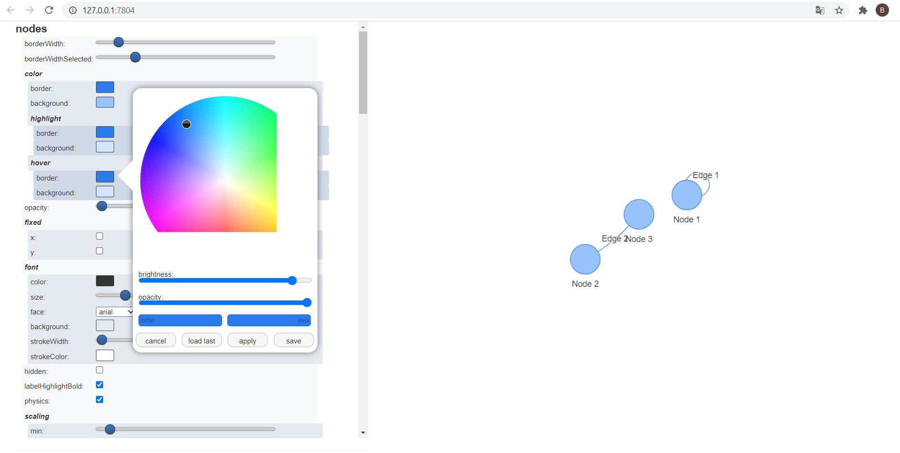

```{r, eval=TRUE, echo = FALSE}
require("visNetwork", quietly = TRUE)
```

## Use **visConfigure()** to configure and view options directly on your network

Don't show here. Test and open the network in a web browser. Can be very usefull to configure your network as wanted !

```{r, eval = FALSE}
nodes <- data.frame(id = 1:3, label = LETTERS[1:3])
edges <- data.frame(from = c(1,2), to = c(1,3))

# don't look in RStudio viewer
visNetwork(nodes, edges, width = "100%") %>%
 visConfigure(enabled = TRUE)
```

<div style="text-align:center" markdown="1">

</div>

## or prefer the shiny app / module visNetworkEditor !

```{r, eval = FALSE}
nodes <- data.frame(id = 1:3, label = paste("Node", 1:3))
edges <- data.frame(from = c(1,2), to = c(1,3), label = paste("Edge", 1:2))
network <- visNetwork(nodes, edges)

custom_network <- visNetworkEditor(object = network)
custom_network
```

<div style="text-align:center" markdown="1">

</div>
