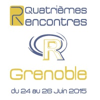

<div style="text-align:center" markdown="1">
<br><br><br><br><br><br>
<h1>visNetwork, an R package for network visualization</h1>
<h2>Quatrièmes Rencontres R</h2>
<h3>B.Thieurmel - bt@datak.fr</h3>
<h3>26/06/2015</h3>



</div>

## Introduction

More and more visualization tools are available with R :

* growing use of Javascript libraries in packages since a few years ([rCharts](http://rcharts.io/), [googleVis](http://cran.r-project.org/web/packages/googleVis/vignettes/googleVis_examples.html), ...)
* amazing [shiny and shiny server](http://shiny.rstudio.com/) tools
* [htmlwidgets](http://www.htmlwidgets.org/), a new 'best-seller' R package for JavaScript data visualization in the next years ?
    + facilitate JavaScript visualization libraries integration
    + use in R console, or with RStudio viewer
    + embed widgets in R Markdown documents and Shiny web applications
    + and save in .html file
    + already a lot of children !
        + [leaflet](http://rstudio.github.io/leaflet/) : creating dynamic maps
        + [dygraphs](http://rstudio.github.io/dygraphs/) : time-series
        + [DT](http://rstudio.github.io/DT/) : interactive HTML tables
        + [threejs](https://github.com/bwlewis/rthreejs/) : 3D scatterplot and 3D globe
        + [rpivotTable](https://github.com/smartinsightsfromdata/rpivotTable) : data exploration, drag'n'drop functionality
        + [networkD3](http://christophergandrud.github.io/networkD3/) : network and sankey diagrams using D3.js
        + [sparkline](https://github.com/htmlwidgets/sparkline) : jquery sparkline
        + ...
        
## visNetwork

**visNetwork** is a R package for network visualization, using [vis.js](http://visjs.org/) javascript library 

* easy to use
* custom shapes, styles, colors, sizes, ...
* works smooth on any modern browser for up to a few thousand nodes and edges
* clustering support foo handle a larger amount of nodes
* interactivity controls (zoom, physics, movement of nodes, tooltip)

<br>
Based on [htmlwidgets](http://www.htmlwidgets.org/), so :

* compatible with [shiny ](http://shiny.rstudio.com/),  R Markdown documents, RStudio viewer, R

<br>
Actually only available on [DataKnowledge github](https://github.com/DataKnowledge)

```{r, eval = FALSE}
# for install visNetwork
devtools::install_github("dataknowledge/visNetwork")
```


```{r, echo = FALSE, message = FALSE}
require(visNetwork, quietly = TRUE)
```

## Minimal example

**visNetwork** needs at least two informations :

* a __nodes__ data.frame, with __id__ column
* a __edges__ data.frame, with __from__ and __to__ columns

```{r}
nodes <- data.frame(id = 1:3)
edges <- data.frame(from = c(1,2), to = c(1,3))
visNetwork(nodes = nodes, edges = edges, width = "1000px", height = "300px")

visNetwork(nodes = nodes, edges = edges)

visNetwork(nodes = nodes, edges = edges, width = "1000px", height = "300px")
```

## Simple individual nodes and edges customization

* Adding more variables on nodes and edges data.frames
<br><br>  
```{r}
nodes <- data.frame(id = 1:4, 
                    label = paste("Node", 1:4),                           # add labels on nodes
                    group = c("GrA", "GrB"),                              # control groups on nodes (adding a color per group)
                    value = 1:4,                                          # control size adding value
                    shape = c("square", "triangle", "box", "circle"),     # control shape of nodes
                    title = paste0("<p>", 1:4,"<br>Node Tooltip !</p>"))       # add tooltip information (html)

edges <- data.frame(from = c(1,1,2,3), 
                    to = c(2,3,4,2),
                    color = c("purple", "green"),                         # add color of edges
                    style = c("line", "arrow", 
                              "arrow-center",  "dash-line"),              # control line style
                    label = paste("Edge", 1:4),                           # add labels on nodes
                    title = paste0("Edge Tooltip ", 1:4))  # add tooltip information (character)
```
<br>

* Numerous additional options are available(label alignment, opacity, font and border style, size control, ...)

----

```{r, echo = FALSE}
visNetwork(nodes, edges, width = "1000px", height = "600px")
```

## Global nodes/edges configuration

* Set global options for nodes and edges using _visNodes_ and _visEdges_, and  use options per group using _visGroups_.
<br>
```{r}
nodes <- data.frame(id = 1:5, group = c(rep("A", 2), rep("B", 3)))
edges <- data.frame(from = c(2,5,3,3), to = c(1,2,4,2))

visNetwork(nodes, edges, width = "100%", height = "300px") %>% 
  visNodes(shape = "square") %>%
  visEdges(arrow ="from") %>%
  visGroups(groupname = "A", color = "darkblue") %>%
  visGroups(groupname = "B", color = "red")
```

## Options
A lot of configuration options are available in *visOptions* :

```{r, echo=FALSE}
nb <- 10
nodes <- data.frame(id = 1:nb, label = paste("Label", 1:nb),
 group = sample(LETTERS[1:3], nb, replace = TRUE), value = 1:nb,
 title = paste0("<p>", 1:nb,"<br>Tooltip !</p>"), stringsAsFactors = FALSE)

edges <- data.frame(from = trunc(runif(nb)*(nb-1))+1,
 to = trunc(runif(nb)*(nb-1))+1,
 value = rnorm(nb, 10), label = paste("Edge", 1:nb),
 title = paste0("<p>", 1:nb,"<br>Edge Tooltip !</p>"))
```

* Highlight nearest nodes and edges clicking on a node

```{r, eval = FALSE}
visNetwork(nodes, edges) %>% visOptions(highlightNearest = TRUE)
```

```{r, echo = FALSE}
visNetwork(nodes, edges, width = "100%", height = "450px") %>% visOptions(highlightNearest = TRUE) %>%
  visPhysics(stabilization = list(iterations = 2000))
```

----

* Add legend on groups
```{r, eval = FALSE}
visNetwork(nodes, edges, width = "100%",  legend = TRUE)
```

```{r, echo = FALSE}
visNetwork(nodes, edges, width = "100%", legend = TRUE, height = "575px") %>%
  visPhysics(stabilization = list(iterations = 2000))
```

----

* Select by node id
```{r, eval = FALSE}
visNetwork(nodes, edges, width = "100%") %>% visOptions(highlightNearest = TRUE, nodesIdSelection = TRUE)
```

```{r, echo = FALSE}
visNetwork(nodes, edges, width = "100%", height = "575px") %>% visOptions( highlightNearest = TRUE, nodesIdSelection = TRUE) %>%
  visPhysics(stabilization = list(iterations = 2000))
```


----

* Data Manipulation

```{r, eval = FALSE}
visNetwork(nodes, edges, width = "100%") %>% visOptions(dataManipulation = TRUE)
```

```{r, echo = FALSE}
visNetwork(nodes, edges, width = "100%", height = "575px") %>% visOptions(manipulation = TRUE) %>%
  visPhysics(stabilization = list(iterations = 2000))
```


